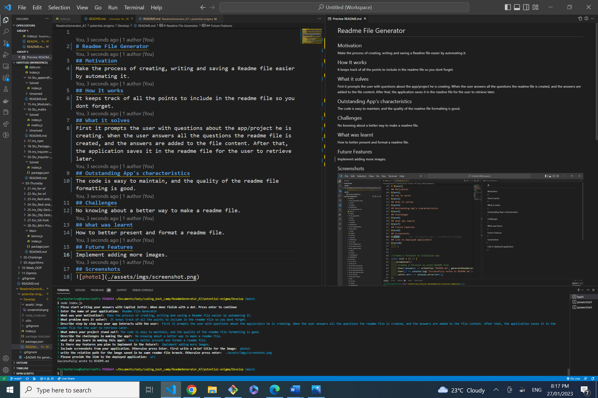

# Readme File Generator
## Description
This app makes the process of creating, writing and saving a Readme file easier by automating it.
## Table of contents

2. [Installation](#installation)
3. [License](#license)
4. [Usage](#usage)
6. [Contributions](#contributions)
7. [Test](#tests)
8. [Questions and issues](#questions-and-issues)
9. [User details](#user-details)
10. [Screenshots](#screenshots)
11. [Link to deployed application](#link-to-deployed-application)
12. [Link to walk through video](#link-to-walk-throughvideo)

## Installation
1.Install the node modules  by writting  in the command line: npm i after that, run the command: node index.js

## License
### Badge

### License Link
<https://opensource.org/licenses/MIT>

### License Section
Copyright <YEAR> <COPYRIGHT HOLDER> Permission is hereby granted, free of charge, toany person obtaining a copy of this software and associated documentation files(the “Software”), to deal in the Software without restriction, including without limitation the rights to use, copy, modify, merge, publish, distribute, sublicense, and / or sell copies of the Software, and to permit persons to whom the Software is furnished to do so, subject to the following conditions:The above copyright notice and this permission notice shall be included in all copies or substantial portions of the Software. THE SOFTWARE IS PROVIDED “AS IS”, WITHOUT WARRANTY OF ANY KIND, EXPRESS OR IMPLIED, INCLUDING BUT NOT LIMITED TO THE WARRANTIES OF MERCHANTABILITY, FITNESS FOR A PARTICULAR PURPOSE AND NONINFRINGEMENT.IN NO EVENT SHALL THE AUTHORS OR COPYRIGHT HOLDERS BE LIABLEFOR ANY CLAIM, DAMAGES OR OTHER LIABILITY, WHETHER IN AN ACTION OF CONTRACT, TORT OR OTHERWISE, ARISING FROM, OUT OF OR IN CONNECTION WITH THE SOFTWARE OR THE USEOR OTHER DEALINGS IN THE SOFTWARE.

## Usage
First it prompts the user with questions about the app/project he is creating.The user must start writing with capital letter and press enter at the end. When the user answers all the questions the readme file is created, and the answers are added to the file content. After that, the application saves it in the readme file for the user to retrieve later.
## Contributions
No contributors
## Tests
It doesnt have tests
## Questions and issues
Need to add tests
## User details
### User email
katy@gmail.com
### User Github username
katita81
## Screenshots

## Link to deployed application
linvideo
## Link to the walk through video
linkdeployed 